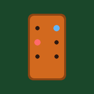

# 🃏 Cribbage PWA

A classic cribbage card game built as a Progressive Web App. Play against an AI opponent with three difficulty levels, learn with built-in tutorials, and track your progress on an authentic cribbage board visualization.



## ✨ Features

### 🎮 Gameplay
- **Full Cribbage Rules** - Complete implementation of traditional cribbage
- **3 AI Difficulty Levels**
  - 🟢 Easy (Newbie Ned) - Random plays
  - 🔵 Medium (Clever Clara) - Basic strategy
  - 🔴 Hard (Master Magnus) - Optimal play with hand analysis
- **Authentic Cribbage Board** - Visual 121-point board with two pegs per player

### 📚 Learning Features
- **How to Play Guide** - Complete rules explanation
- **Scoring Reference Card** - Quick lookup for all scoring combinations
- **Phase Indicator** - Shows current game phase with instructions
- **Hint System** - Get strategic advice for discarding and pegging
- **Manual Scoring Mode** - Practice counting hands yourself
- **Card Highlighting** - Unplayable cards are dimmed during pegging
- **Tooltips** - Hover explanations for game elements

### 🎨 Polish
- **Sound Effects** - Card plays, scoring, wins (Web Audio API)
- **Animations** - Card deals, score popups, win celebration
- **Responsive Design** - Works on desktop and mobile
- **Collapsible Board** - Hide the board on small screens

### 📱 PWA Features
- **Installable** - Add to home screen on mobile/desktop
- **Offline Support** - Play without internet connection
- **Fast Loading** - Cached resources for instant startup

## 🚀 Play Now

Visit: **[https://yourusername.github.io/cribbage-pwa/](https://yourusername.github.io/cribbage-pwa/)**

Or install as an app:
1. Open the link in Chrome/Safari
2. Click "Add to Home Screen" or the install icon in the address bar
3. Launch from your home screen like a native app!

## 🛠️ Development

### Local Development
```bash
# Clone the repository
git clone https://github.com/yourusername/cribbage-pwa.git
cd cribbage-pwa

# Serve locally (requires a local server for PWA features)
npx serve .
# or
python -m http.server 8000
```

### Project Structure
```
cribbage-pwa/
├── index.html      # Main game (single-file React app)
├── manifest.json   # PWA manifest
├── sw.js           # Service worker for offline support
├── icons/          # App icons in various sizes
│   ├── icon-72.png
│   ├── icon-96.png
│   ├── icon-128.png
│   ├── icon-144.png
│   ├── icon-152.png
│   ├── icon-192.png
│   ├── icon-384.png
│   ├── icon-512.png
│   └── icon.svg
└── README.md
```

### Technologies
- **React 18** - UI framework (loaded from CDN)
- **Babel** - JSX transformation in browser
- **Web Audio API** - Sound effects
- **Service Workers** - Offline functionality
- **CSS Animations** - Visual polish

## 📋 Game Rules Quick Reference

### Scoring
| Combination | Points |
|-------------|--------|
| Fifteen (cards totaling 15) | 2 |
| Pair | 2 |
| Three of a Kind | 6 |
| Four of a Kind | 12 |
| Run of 3 | 3 |
| Run of 4 | 4 |
| Run of 5 | 5 |
| Flush (4 in hand) | 4 |
| Flush (5 with starter) | 5 |
| Nobs (Jack of starter suit) | 1 |
| His Heels (starter is Jack) | 2 |

### Game Flow
1. **Deal** - 6 cards each
2. **Discard** - Each player puts 2 cards in the crib
3. **Cut** - Reveal starter card
4. **Pegging** - Alternate playing cards (count to 31)
5. **Counting** - Score hands: pone, dealer, then crib

## 🎯 Tips for Beginners
- Keep 5s - they make fifteens easily
- Don't give 5s to opponent's crib
- In pegging, try to avoid leaving count at 5, 10, or 21
- Use the 💡 Hint button when stuck!

## 📄 License

MIT License - feel free to use, modify, and share!

## 🙏 Credits

- Card design inspired by classic playing cards
- Cribbage board based on traditional wooden boards
- Built with ❤️ for cribbage enthusiasts

---

*First to 121 wins! Good luck and have fun!*
